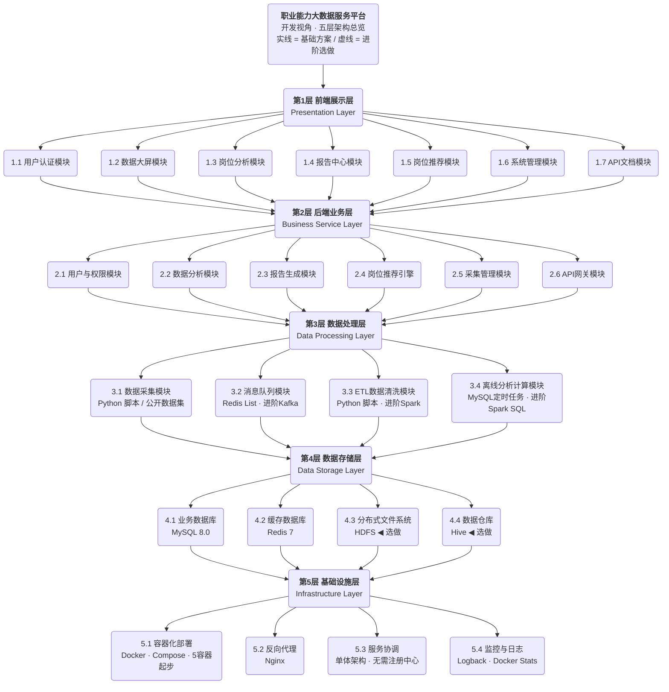
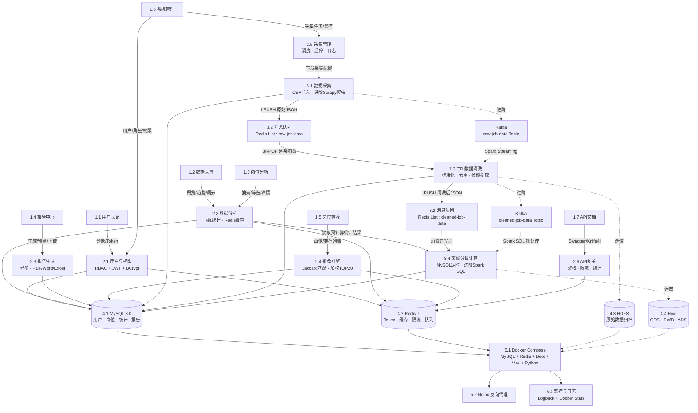

# 职业能力大数据服务平台 — 架构设计文档

> **实训说明：** 本架构采用**"基础 + 进阶"**两级设计。基础方案仅需 MySQL + Redis + Spring Boot + Vue 3 + Python ETL 五个组件即可跑通核心链路（数据导入 → 清洗 → 分析 → 展示 → 推荐），适合学生团队在实训周期内完整交付。大数据组件（Kafka、Hadoop、Spark、Hive）作为进阶选做，供学有余力的团队扩展。

---

## 一、思维导图

### 1.1 模块分层总览

> 展示系统五层架构及每层包含的模块，适合快速了解项目全貌。



---

### 1.2 模块交互与数据流

> 展示模块间的直接调用关系与数据流转路径，适合理解"谁调谁、数据怎么走"。

> 实线 = 基础方案核心链路 / 虚线 = 进阶选做 / 箭头方向 = 调用/数据流向




---

## 二、各层与模块详述

---

### 1. 前端展示层

> 技术栈：Vue 3 + Element Plus + ECharts + Axios + Vue Router + Pinia

---

#### 1.1 用户认证模块

**与相邻模块的交互接口：**

| 方向 | 交互方 | 接口设计 | 数据格式 |
|------|--------|----------|----------|
| 向下 | 后端 `2.1 用户与权限模块` | `POST /api/auth/login` — 账号密码登录 | `{username, password}` → `{token, userInfo}` |
| | | `POST /api/auth/register` — 注册 | `{username, password, role}` |
| | | `POST /api/auth/logout` — 登出 | `{token}` |
| | | `GET /api/auth/me` — 获取当前用户信息 | `Authorization: Bearer <token>` → `{user}` |

**具体功能：**

- 登录页面（账号密码 + 验证码）
- 注册页面（选择角色：学生/教师）
- Token 存储与自动刷新（前端拦截器附加 Authorization 头）
- 401 拦截自动跳转登录页
- 密码修改、密码重置（管理员操作）
- 记住我功能（LocalStorage 持久化）

---

#### 1.2 数据大屏模块

**与相邻模块的交互接口：**

| 方向 | 交互方 | 接口设计 | 数据格式 |
|------|--------|----------|----------|
| 向下 | 后端 `2.2 数据分析模块` | `GET /api/dashboard/overview` — 概览数据 | 全量聚合指标 |
| | | `GET /api/dashboard/hot-positions` — 热门岗位TOP10 | 岗位名称 + 数量 + 趋势箭头 |
| | | `GET /api/dashboard/salary-ranking` — 城市薪资排名 | 城市 + 平均薪资 |
| | | `GET /api/dashboard/skill-cloud` — 技能词云数据 | 技能名 + 词频权重 |
| | | `GET /api/dashboard/trend` — 月度岗位趋势 | 月份 + 新增量 + 增长率 |

**具体功能：**

- 就业概览仪表盘（全屏大屏展示）
- 核心指标卡片：总岗位数、本月新增、平均薪资、活跃企业数
- ECharts 图表：岗位趋势折线图、城市薪资柱状图、技能词云、学历分布饼图、行业分布雷达图
- 自动刷新（可配置间隔 30s/60s/120s）
- 适配 1920×1080 全屏分辨率

---

#### 1.3 岗位分析模块

**与相邻模块的交互接口：**

| 方向 | 交互方 | 接口设计 | 数据格式 |
|------|--------|----------|----------|
| 向下 | 后端 `2.2 数据分析模块` | `GET /api/positions?keyword=&city=&salary=&edu=&exp=&page=&size=` | 分页岗位列表 |
| | | `GET /api/positions/{id}` — 岗位详情 | 完整岗位信息 |
| | | `GET /api/analysis/salary-distribution?position=` | 薪资区间分布 |
| | | `GET /api/analysis/skills?position=` | 该岗位技能需求排行 |
| | | `GET /api/analysis/city-ranking?position=` | 该岗位城市分布 |
| | | `GET /api/analysis/education?position=` | 该岗位学历要求分布 |
| | | `GET /api/positions/hot?limit=20` — 热门岗位TOP20 | 岗位列表 |
| | | `GET /api/positions/search/suggest?keyword=` — 搜索建议 | 建议词列表 |

**具体功能：**

- 岗位搜索页（关键字搜索 + 多条件筛选：城市/薪资/学历/经验/行业）
- 岗位列表展示（分页 + 卡片视图/列表视图切换）
- 岗位详情页（企业信息、薪资范围、技能标签、学历经验要求、福利待遇、发布时间）
- 技能需求排行榜（横向柱状图，如 SpringBoot 92%）
- 城市分布可视化（ECharts 中国地图热力图）
- 同类岗位对比功能

---

#### 1.4 报告中心模块

**与相邻模块的交互接口：**

| 方向 | 交互方 | 接口设计 | 数据格式 |
|------|--------|----------|----------|
| 向下 | 后端 `2.3 报告生成模块` | `POST /api/reports/generate` — 生成报告 | `{template, timeRange, dimensions[]}` → `{reportId}` |
| | | `GET /api/reports` — 报告列表 | 分页报告列表 |
| | | `GET /api/reports/{id}` — 报告详情/预览 | 报告元信息 + 内容 |
| | | `GET /api/reports/{id}/download?format=pdf` — 下载 | 二进制文件流 |
| | | `DELETE /api/reports/{id}` — 删除 | |

**具体功能：**

- 报告列表页（按时间、类型筛选，列表含状态标签：生成中/已完成/失败）
- 报告生成引导（选择模板 → 选择时间范围 → 选择分析维度 → 一键生成）
- 在线预览（HTML 渲染预览）
- 多格式下载（PDF / Word / Excel）
- 历史报告归档与检索

---

#### 1.5 岗位推荐模块

**与相邻模块的交互接口：**

| 方向 | 交互方 | 接口设计 | 数据格式 |
|------|--------|----------|----------|
| 向下 | 后端 `2.4 岗位推荐引擎` | `GET /api/recommend/positions?userId=` — 获取推荐 | `{positions[], matchScores[]}` |
| | | `PUT /api/recommend/profile` — 更新学生画像 | `{major, skills[], education, city, salary}` |
| | | `GET /api/recommend/profile/{userId}` — 获取画像 | 画像对象 |

**具体功能：**

- 画像编辑页（填写专业、技能标签、学历、意向城市、期望薪资）
- 推荐岗位列表（按匹配度降序排列）
- 每个推荐卡片展示：岗位名、企业名、薪资、匹配度百分比、匹配/未匹配技能对比、推荐指数星级
- 点击进入岗位详情（可查看该岗位完整信息）
- 技能差距分析面板（"你还需要学习：Docker、K8s" 提示）

---

#### 1.6 系统管理模块

**与相邻模块的交互接口：**

| 方向 | 交互方 | 接口设计 | 数据格式 |
|------|--------|----------|----------|
| 向下 | 后端 `2.1 用户与权限模块` | `GET/POST/PUT/DELETE /api/admin/users` — 用户CRUD | 用户对象 |
| | | `GET/POST/PUT/DELETE /api/admin/roles` — 角色CRUD | 角色对象 |
| | | `GET/POST/PUT /api/admin/permissions` — 权限管理 | 权限配置 |
| | | `GET /api/admin/logs` — 操作日志 | 日志列表(分页) |
| 向下 | 后端 `2.5 采集管理模块` | `GET /api/admin/collect/tasks` — 采集任务状态 | 任务列表 |
| | | `POST /api/admin/collect/tasks/{id}/toggle` — 启停任务 | 操作结果 |

**具体功能：**

- 用户管理（表格 + 增删改查 + 批量导入Excel + 密码重置）
- 角色管理（创建角色 → 分配权限矩阵）
- 权限分配（页面级：菜单可见性；数据级：仅看本院/全校）
- 操作日志（审计列表：谁、何时、做了什么、IP）
- 采集任务监控面板（任务状态、采集量统计、异常告警）

---

#### 1.7 API文档模块

**与相邻模块的交互接口：**

| 方向 | 交互方 | 接口设计 | 数据格式 |
|------|--------|----------|----------|
| 向下 | 后端 `2.6 API网关服务` | Swagger JSON / Knife4j 接口文档 | OpenAPI 3.0 规范 |

**具体功能：**

- API 文档在线浏览（基于 Knife4j / Swagger UI 渲染）
- 接口分组展示：岗位统计、薪资分析、技能分析、地域分析、报告
- 在线调试（填写参数 → 发送请求 → 查看响应）
- Token 申请与管理页面（开发者注册 → 申请 API Key → 查看调用量）

---

### 2. 后端业务层

> 技术栈：Spring Boot 2.7+ + Spring MVC + Spring Data JPA + Spring Security + Redis + Kafka（可选）
>
> **架构说明：** 采用模块化单体架构，所有业务模块位于同一个 Spring Boot 应用中，模块间通过直接方法调用协作，无需 Feign 或服务发现。单体架构简化了开发、测试和部署流程，适合学生实训项目的规模和周期。

---

#### 2.1 用户与权限模块

**与相邻模块的交互接口：**

| 方向 | 交互方 | 接口设计 | 数据格式 |
|------|--------|----------|----------|
| 向上 | 前端 `1.1 登录` `1.6 管理` | 提供 RESTful API | JSON |
| 横向 | 各业务模块 | 提供 JWT 校验工具类 / SecurityContext | 方法调用 |
| 向下 | 存储层 `4.1 MySQL` + `4.2 Redis` | MySQL 存储用户/角色/权限表；Redis 缓存 Session + Token | |

**具体功能：**

- 认证：Spring Security + JWT（无状态 Token，过期时间 2h，RefreshToken 7d）
- 授权：RBAC 模型（用户 → 角色 → 权限），方法级注解 `@PreAuthorize`
- 用户 CRUD + 批量导入（Excel 解析 Apache POI）
- 密码加密：BCryptPasswordEncoder
- 登录限流：Redis + 滑动窗口（同一账号 5 分钟内最多 5 次失败，锁定 15 分钟）
- 操作日志：AOP 切面自动记录关键操作（`@Log` 注解标记）

---

#### 2.2 数据分析模块

**与相邻模块的交互接口：**

| 方向 | 交互方 | 接口设计 | 数据格式 |
|------|--------|----------|----------|
| 向上 | 前端 `1.2 大屏` `1.3 岗位分析` | 提供查询 API | JSON 分页/聚合结果 |
| 横向 | 报告模块 `2.3`、推荐引擎 `2.4` | 模块间直接方法调用 | Java DTO |
| 向下 | 存储层 `4.1 MySQL` `4.2 Redis` | MyBatis/JPA 查询 + Redis 缓存热点统计 | |

**具体功能：**

- 7 大分析维度实现：岗位统计、薪资分析、学历分析、技能分析、地域分析、企业分析、趋势分析
- Redis 缓存策略：热点查询结果缓存 30min（如 TOP20 排行），数据更新时主动失效
- 支持时间范围筛选（本月/本季/本年/自定义）
- 支持城市、岗位类型、行业等多维度交叉筛选
- 分页查询 + 排序（按薪资/热度/发布时间）

---

#### 2.3 报告生成模块

**与相邻模块的交互接口：**

| 方向 | 交互方 | 接口设计 | 数据格式 |
|------|--------|----------|----------|
| 向上 | 前端 `1.4 报告中心` | RESTful API | JSON + 文件流 |
| 横向 | 数据分析模块 `2.2` | 调用统计接口获取数据 | Java DTO |
| 向下 | 存储层 `4.1 MySQL` | 存储报告元信息 + 模板 | |

**具体功能：**

- 报告模板引擎：基于 Apache POI / iText / Freemarker 模板填充
- 模板管理：预置"月度就业分析报告""年度趋势报告""技能需求报告"模板，支持自定义
- 数据注入：调用数据分析服务获取各维度数据 → 填充模板 → 生成图表图片（JFreeChart）→ 嵌入报告
- 导出格式：PDF（iText）、Word（POI）、Excel（EasyExcel）
- 异步生成：大型报告通过 `@Async` + 线程池异步生成，前端轮询状态
- 历史归档：按年月分目录存储，支持按时间检索

---

#### 2.4 岗位推荐引擎

**与相邻模块的交互接口：**

| 方向 | 交互方 | 接口设计 | 数据格式 |
|------|--------|----------|----------|
| 向上 | 前端 `1.5 岗位推荐` | RESTful API | JSON 推荐结果 |
| 横向 | 数据分析模块 `2.2` | 获取岗位画像数据 | Java DTO |
| 向下 | 存储层 `4.1 MySQL` `4.2 Redis` | 存储画像 + 缓存推荐结果 | |

**具体功能：**

- 学生画像构建：专业、技能列表（标签）、学历、意向城市、期望薪资范围
- 岗位画像构建：要求技能、学历、城市、薪资范围（从岗位数据中提取）
- 基于内容的匹配算法：
  - 技能匹配权重 40%（核心维度，使用 Jaccard 相似系数）
  - 学历匹配权重 15%（精确匹配 + 降级匹配）
  - 城市匹配权重 20%（精确 + 周边城市降权）
  - 薪资匹配权重 15%（区间重叠度）
  - 专业匹配权重 10%（专业名称模糊匹配）
- 综合得分排序，返回 TOP 20
- 返回匹配详情：匹配技能列表、未匹配技能列表、各项得分明细
- 推荐结果缓存（同一画像 1h 内不重复计算）

---

#### 2.5 采集管理模块

**与相邻模块的交互接口：**

| 方向 | 交互方 | 接口设计 | 数据格式 |
|------|--------|----------|----------|
| 向上 | 前端 `1.6 系统管理` | RESTful API | JSON |
| 横向 | 数据处理层 `3.1 数据采集` | 通过数据库配置下发 | |
| 向下 | 存储层 `4.1 MySQL` | 存储采集源配置 + 任务日志 | |

**具体功能：**

- 数据源配置：数据集文件路径、字段映射、导入频率
- （选做）采集源配置：URL 模板、翻页规则（CSS Selector/XPath）、采集频率（Cron 表达式）
- 任务管理：创建、启动、暂停、删除数据导入任务
- 调度引擎：集成 Spring Task `@Scheduled`，按 Cron 触发
- 监控统计：日导入量、成功率、失败率、异常日志
- 失败处理：失败重试策略（最多 3 次，指数退避 1min/5min/15min）

---

#### 2.6 API网关模块

**与相邻模块的交互接口：**

| 方向 | 交互方 | 接口设计 | 数据格式 |
|------|--------|----------|----------|
| 向上 | 外部第三方系统 + 前端 `1.7` | 开放 RESTful API | JSON |
| 横向 | 数据分析模块 `2.2`、报告模块 `2.3` | 内部 Filter/Interceptor 转发 | HTTP |
| 向下 | 存储层 `4.2 Redis` | Token 校验 + 限流计数 | |

**具体功能：**

- API 认证：API Key / Token 双重认证机制
- 限流控制：基于 Redis 的令牌桶算法（每 API Key 100 次/分钟）
- 请求路由：通过 Spring Interceptor 统一拦截 `/api/open/**` 路径
- 响应统一封装：`{code, message, data, timestamp}`
- 调用统计：记录每次 API 调用（调用方、接口、时间、耗时），用于计费/监控
- API 文档自动生成：集成 Knife4j（Swagger 增强）

---

### 3. 数据处理层

> 技术栈：Python Scrapy + Kafka(可选，可降级为Redis List) + Spark 3.x + Hive(可选，可用MySQL替代)

---

#### 3.1 数据采集模块

**与相邻模块的交互接口：**

| 方向 | 交互方 | 接口设计 | 数据格式 |
|------|--------|----------|----------|
| 向上 | `2.5 采集管理模块` | 读取 MySQL 采集配置表 | 配置 JSON |
| 横向 | `3.2 消息队列` | 将数据导入 Redis List `queue:raw-job-data`（进阶：Kafka `raw-job-data`） | JSON 格式岗位数据 |
| 向下 | 公开数据集 / 招聘网站 | 读取 CSV/Excel 文件（进阶：HTTP 请求 + HTML 解析） | |

**数据来源优先级：**

> **实训项目默认方案：** 使用公开招聘数据集（Kaggle、天池等平台的 CSV 文件）作为数据输入，通过 Python 脚本读取并转换为标准格式。学生无需应对反爬对抗，可专注于数据处理和分析核心逻辑。

**进阶方案（选做）：** Scrapy 爬虫引擎，从招聘网站直接采集。

**具体功能：**

- 数据导入：Python 脚本读取 CSV/Excel 公开数据集 → 转换为标准 JSON 格式
- （选做）Scrapy 爬虫引擎：每个招聘网站一个 Spider
- （选做）定时采集：从 MySQL 读取 Cron 配置，APScheduler 调度
- 增量导入：基于文件时间戳 + URL/ID 哈希去重
- 数据标准化：不同来源的原始数据统一为内部格式
- 结构化输出：
```json
{
  "jobId": "唯一标识",
  "title": "岗位名称",
  "company": { "name": "", "size": "", "industry": "", "type": "" },
  "salary": { "min": 8000, "max": 15000 },
  "city": "城市",
  "education": "学历要求",
  "experience": "经验要求",
  "skills": ["技能1", "技能2"],
  "welfare": ["福利1", "福利2"],
  "publishDate": "发布时间",
  "sourceUrl": "原始URL",
  "crawlTime": "采集时间戳"
}
```

---

#### 3.2 消息队列模块

**与相邻模块的交互接口：**

| 方向 | 交互方 | 通道 | 数据流向 |
|------|--------|-------|----------|
| 上游 | `3.1 数据采集` | Redis `queue:raw-job-data`（或 Kafka `raw-job-data`） | 接收采集的原始岗位数据 |
| 下游 | `3.3 ETL清洗` | Redis `queue:raw-job-data`（或 Kafka `raw-job-data`） | 清洗模块消费 |
| 下游 | `3.4 离线分析` | Redis `queue:cleaned-job-data`（或 Kafka `cleaned-job-data`） | ETL 完成后的清洗结果 |

**具体功能：**

- **实训默认方案：Redis List 作为轻量级消息队列**
  - 采集脚本将数据 `LPUSH` 到 `queue:raw-job-data`
  - ETL 模块 `BRPOP` 消费，处理后将结果 `LPUSH` 到 `queue:cleaned-job-data`
  - 优点：零额外组件，Redis 已在架构中，部署简单
- **进阶方案（选做）：Kafka**
  - 单节点部署（KRaft 模式，无需 Zookeeper）
  - Topic 设计：`raw-job-data`（原始数据）、`cleaned-job-data`（清洗后数据）
  - Producer 端：异步发送，压缩类型 gzip
  - Consumer 端：自动提交 Offset，保证至少一次消费语义

---

#### 3.3 ETL数据清洗模块

**与相邻模块的交互接口：**

| 方向 | 交互方 | 接口设计 | 数据格式 |
|------|--------|----------|----------|
| 上游 | `3.2 消息队列` | 消费 Redis List `queue:raw-job-data`（进阶：Kafka `raw-job-data`） | JSON 原始岗位 |
| 下游 | `3.2 消息队列` | 产入 Redis List `queue:cleaned-job-data`（进阶：Kafka `cleaned-job-data`） | JSON 清洗后岗位 |
| 下游 | `4.3 HDFS` | 原始数据归档写入 | CSV/JSON 文件 |
| 下游 | `4.1 MySQL` | 清洗后数据写入 MySQL 岗位表（`job_position` 等） | MySQL 行 |

**具体功能：**

- 实训默认方案：Python 脚本从 Redis List 消费数据，逐条清洗后写回 Redis List + MySQL
- 进阶方案（选做）：Spark Structured Streaming 消费 Kafka，批量处理
- 清洗规则：
  - 空值处理：必填字段（岗位名、公司名）为空 → 丢弃
  - 薪资标准化：统一为月薪（K为单位），处理"面议"等模糊表述
  - 城市标准化：二级城市映射到所属省份 + 城市层级（一线/新一线/二线）
  - 学历标准化：映射为统一枚举（不限/大专/本科/硕士/博士）
  - 经验标准化：映射为统一枚举（不限/应届/1-3年/3-5年/5-10年/10年以上）
  - 技能提取：从岗位描述中基于预置技能词典（500+ 常见技术关键词）做关键词匹配
  - 重复检测：jobId + sourceUrl MD5 双重去重
- 数据质量监控：每日统计各字段完整率

---

#### 3.4 离线分析计算模块

**与相邻模块的交互接口：**

| 方向 | 交互方 | 接口设计 | 数据格式 |
|------|--------|----------|----------|
| 上游 | `4.1 MySQL` | 读取 MySQL 岗位表进行统计查询 | SQL |
| 下游 | 业务层 `2.2 数据分析模块` | 将分析结果写入 MySQL 统计结果表 | JDBC |

**具体功能：**

- **实训默认方案：MySQL + Spring Boot 定时任务**
  - 在 Spring Boot 中编写 SQL 统计查询 + `@Scheduled` 定时执行（每日凌晨 2:00）
  - 计算任务：岗位分类统计、薪资 avg/median、热门岗位 TOP20、热门技能 TOP30、热门城市 TOP10
  - 分析结果写入 `stat_*` 系列统计表，供业务层直接查询
- **进阶方案（选做）：Spark SQL + Hive**
  - Spark SQL 离线批处理，读取 Hive 全量数据
  - Hive 作为数据仓库层，按 `dt` 日期分区存储
  - 支持交叉分析：学历×薪资、城市×薪资、技能×薪资
  - 对于历史数据的批量重算，直接使用 Spark SQL 的全量扫描能力

---

### 4. 数据存储层

---

#### 4.1 业务数据库 (MySQL 8.0)

| 存储内容 | 关键表 | 说明 |
|---------|--------|------|
| 用户数据 | `sys_user`, `sys_role`, `sys_permission`, `sys_user_role` | RBAC 权限模型 |
| 岗位数据 | `job_position`, `job_company`, `job_skill` | 清洗后的结构化岗位数据 |
| 分析结果 | `stat_*` 系列表 | 预计算统计结果（日/周/月粒度） |
| 报告数据 | `report_template`, `report_record` | 模板信息 + 生成记录 |
| 采集配置 | `collect_source`, `collect_task`, `collect_log` | 爬虫配置与日志 |
| 学生画像 | `student_profile` | 推荐系统输入 |
| API管理 | `api_key`, `api_call_log` | 开放API管理 |

**交互设计：** 主要服务于后端业务层的读写操作，通过 Spring Data JPA / MyBatis 访问，分析结果通过 Spark JDBC 批量写入。

---

#### 4.2 缓存数据库 (Redis 7)

| 缓存内容 | Key 模式 | TTL | 说明 |
|---------|---------|-----|------|
| 用户 Token | `token:{userId}` | 2h | JWT 黑名单校验 + Session |
| 热点统计 | `stat:{dimension}:{key}` | 30min | TOP20、平均值等高频查询 |
| 采集去重 | `crawl:dedup:{urlHash}` | 30d | URL 哈希去重集合 |
| API 限流 | `ratelimit:{apiKey}:{minute}` | 1min | 令牌桶计数器 |
| 推荐缓存 | `recommend:{userId}` | 1h | 个性化推荐结果 |
| 分布式锁 | `lock:{resource}` | 30s | 定时任务互斥 |

**交互设计：** 后端服务通过 Spring Data Redis / Jedis 访问；ETL 模块通过 Redis 做采集去重；网关通过 Redis 做限流。

---

#### 4.3 分布式文件系统 (HDFS)

| 存储内容 | 目录结构 | 格式 | 保留策略 |
|---------|---------|------|---------|
| 原始数据归档 | `/data/raw/{year}/{month}/{day}/` | JSON / Parquet | 永久 |
| 清洗后数据 | `/data/cleaned/{year}/{month}/{day}/` | Parquet (Snappy压缩) | 永久 |
| 分析中间结果 | `/data/tmp/` | Parquet | 7天自动清理 |
| 报告文件 | `/data/reports/{year}/{month}/` | PDF/Word/Excel | 永久 |

**交互设计：** Spark 任务读写 HDFS；NameNode HA 保证高可用（通过 Zookeeper 选主）。

---

#### 4.4 数据仓库 (Hive) — 选做

仅在进阶方案中引入，用于存储全量清洗后数据和大规模离线分析。实训默认方案直接用 MySQL 存储分析结果。

| 表名 | 分区键 | 说明 |
|------|--------|------|
| `ods_job_raw` | `dt` (日期) | ODS 层：原始岗位数据（贴源层） |
| `dwd_job_detail` | `dt` | DWD 层：清洗后的明细宽表 |
| `ads_job_hot_skills` | `month` | ADS 层：热门技能分析 |
| `ads_city_salary_rank` | `month` | ADS 层：城市薪资排名 |

**交互设计：** Hive 元数据存储在 MySQL（Hive Metastore）；Spark SQL 通过 HiveContext 查询。

---


---

### 5. 基础设施层

---

#### 5.1 容器化部署

**实训默认部署（5 个容器）：**

| 组件 | 部署方式 | 说明 |
|------|---------|------|
| MySQL 8.0 | Docker Compose | 数据持久化挂载 Volume |
| Redis 7 | Docker Compose | 缓存 + 消息队列 |
| Spring Boot 应用 | Docker 容器化 | 单体应用，单镜像部署 |
| Vue 前端 | Nginx 静态资源 + Docker | 多阶段构建 |
| Python ETL 脚本 | Docker 容器 | Python 3 环境 |

**进阶部署（选做，新增以下容器）：**

| 组件 | 部署方式 | 说明 |
|------|---------|------|
| Kafka | Docker Compose | KRaft 模式（无需 ZooKeeper） |
| Hadoop 生态 | Docker Compose | HDFS + Spark |

**交互设计：** 统一的 `docker-compose.yml` 编排所有服务；自定义网络 `job-data-net` 实现服务发现；关键数据目录挂载宿主机 Volume。

---

#### 5.2 反向代理与负载均衡

| 功能 | 配置 | 说明 |
|------|------|------|
| 前端静态资源 | `location /` → Vue dist | SPA 模式，try_files |
| API 代理 | `location /api/` → `backend:8080` | 代理到 Spring Boot |
| WebSocket | `location /ws/` → 后端 | 大屏实时推送 |
| 上传文件限制 | `client_max_body_size 50m` | 报告上传 |
| Gzip 压缩 | `gzip on` | 文本资源压缩 |
| HTTPS | 可选配置 | 生产环境强制 |

---

#### 5.3 服务协调

- **Spring Boot 应用**：单体架构，通过 Nginx 直接反向代理，无需注册中心
- **Kafka**（选做）：Kafka 3.x 内置 KRaft 共识，不依赖 Zookeeper
- **Zookeeper**：仅在进阶方案启用 HDFS HA 时部署，实训默认方案不需要

---

#### 5.4 监控与日志

| 层面 | 工具/方案 | 说明 |
|------|----------|------|
| 应用日志 | Logback → 文件 + ELK (可选) | 结构化日志（JSON 格式）|
| 容器监控 | Docker Stats + cAdvisor | CPU/内存/网络 |
| 采集监控 | 采集量、成功率 → MySQL → 管理后台展示 | 业务级监控 |
| 告警 | 钉钉/邮件 Webhook | 采集异常、服务宕机告警 |

---

## 三、总结

### 3.1 设计理念

本架构设计遵循**分层解耦、逐级收敛**的原则：

1. **纵向分层、横向分模块**：从底层基础设施到上层前端展示共 5 层，每层内部按功能拆分为若干独立模块，模块间通过定义清晰的接口（RESTful API、Kafka Topic、JDBC、Redis Key）进行交互，降低耦合。

2. **数据驱动**：整个系统的核心是"数据"，一条招聘数据从互联网采集 → Kafka 流转 → Spark 清洗 → Hive 入库 → Spark SQL 分析 → MySQL 落地 → 前端展示 / 报告生成 / API 输出，形成完整的数据生命周期。

3. **热点分离**：高频查询（TOP20、大屏数据）走 Redis 缓存，低频深度分析走 Spark SQL，业务 CRUD 走 MySQL，做到冷热数据分离、读写分离。

4. **渐进式部署**：实训默认仅需 5 个 Docker 容器（MySQL + Redis + Spring Boot + Vue + Python ETL），大数据组件（Kafka/Hadoop/Spark/Hive）作为进阶选做，确保学生能在有限时间内完成核心功能开发。

### 3.2 数据流向

**实训默认方案（核心链路）：**

```
              公开数据集 (CSV/Excel)
                      │
                      ▼
            [3.1 Python数据导入脚本] ──→ MySQL (采集日志)
                      │
                      ▼
            [3.2 Redis List] queue:raw-job-data
                      │
                      ▼
            [3.3 Python ETL清洗脚本] ──→ HDFS (原始归档, 可选)
                      │
                      ▼
            [3.2 Redis List] queue:cleaned-job-data
                      │
                      ▼
            [4.1 MySQL] (岗位表 + 统计结果表)
                      │
                      ▼
            [4.2 Redis 缓存]
                      │
                ┌─────┴──────┐
                ▼             ▼
 [2. 后端业务层 (Spring Boot)]  [2.6 API网关 → 外部系统]
                │
                ▼
       [1. 前端展示层 (Vue 3)]
    (大屏 / 分析 / 报告 / 推荐 / 管理)
```

**进阶数据链路（选做，引入大数据组件）：**

```
              互联网招聘网站
                      │
                      ▼
            [3.1 Scrapy爬虫] ──→ MySQL (采集配置/日志)
                      │
                      ▼
            [3.2 Kafka] raw-job-data Topic
                      │
                      ▼
            [3.3 ETL清洗 (Spark)] ──→ [4.3 HDFS] (原始归档)
                      │
                      ▼
            [3.2 Kafka] cleaned-job-data Topic
                      │
                      ▼
            [4.4 Hive 数据仓库] ←── [3.4 Spark SQL 离线分析]
                      │                        │
                      ▼                        ▼
            [4.3 HDFS] (归档)          [4.1 MySQL 分析结果表]
                                               │
                                               ▼
                                      [4.2 Redis 缓存]
                                               │
                                         ┌─────┴──────┐
                                         ▼             ▼
                          [2. 后端业务层 (单体应用)]    [2.6 API网关 → 外部系统]
                                         │
                                         ▼
                                [1. 前端展示层]
```

### 3.3 不同用户视角下的系统面貌

**学生视角：**
登录后看到**岗位推荐首页**，展示与自己专业和技能匹配的岗位列表，每个岗位附有匹配度百分比。左侧导航可进入"岗位分析"查看热门岗位排行、技能需求趋势、各城市薪资对比。顶部有"我的画像"入口，可随时更新个人信息以获得更精准的推荐。整个界面呈现"帮你找方向"的导向。

**教师视角：**
登录后默认进入**数据大屏**或**分析仪表盘**，看到就业概览指标（总岗位数、热门技能、薪资趋势）。主导航侧重"数据分析"和"报告中心"，可以按岗位/行业/城市多维度查询统计数据并导出图表。报告中心支持一键生成就业分析报告并下载。整个界面呈现"数据驱动决策"的导向。

**管理员/数据分析员视角：**
登录后拥有完整菜单，除了学生和教师的功能外，还有**系统管理**（用户/角色/权限）和**采集管理**（采集任务状态、采集量监控、异常告警）。API 文档入口用于管理对外开放接口。整个界面呈现"平台运营管理"的导向。

**外部开发者视角：**
不登录平台，直接访问 `/api/docs` 查看 API 文档，申请 API Key 后通过 Token 调用岗位统计、薪资分析、技能分析等接口，将数据集成到自己的系统中。
